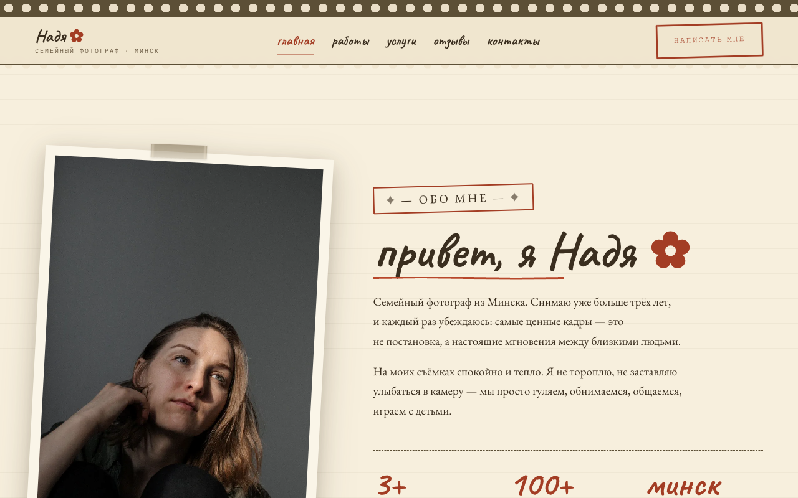
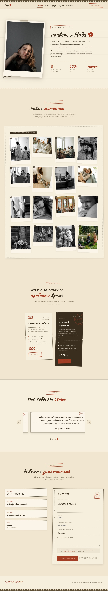
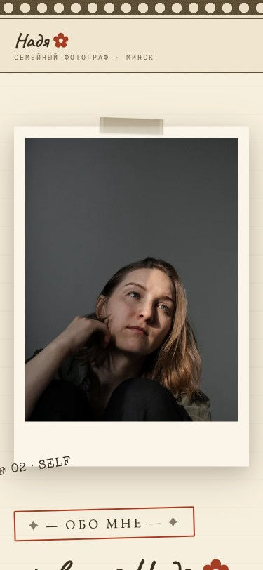

# Семейный фотограф — Надежда Банцаревич (Минск) · v2 «Плёночный альбом»

> **Финальный проект для сдачи домашнего задания.**
> Сайт-портфолио семейного фотографа в эстетике «плёночный альбом из 80-х».
> Стек: **HTML / CSS / vanilla JS** (без фреймворков, без сборки).

🌐 **Прод:** [taupe-brioche-7aad5d.netlify.app](https://taupe-brioche-7aad5d.netlify.app/)
💻 **Код:** [github.com/lexa83947/family-photographer-v2](https://github.com/lexa83947/family-photographer-v2)
📄 **План релиза:** [docs/PLAN.md](docs/PLAN.md) · **Changelog:** [CHANGELOG.md](CHANGELOG.md)

---



---

## 🎯 О проекте

Это сайт-портфолио реального фотографа — Надежды Банцаревич из Минска. Цель —
создать не «ещё один сайт-визитку», а **эмоциональный продукт**: раскрытый
плёночный альбом, в который хочется залипнуть. Каждая деталь (скотч, штампы,
перфорация, рукописные подписи) поддерживает эту метафору.

**Целевая аудитория:** семьи с детьми, пары, будущие мамы в Минске, которые
ищут «живую» съёмку вместо постановочной.

**Эстетика:** «Плёночный альбом» — повёрнутые полароиды, штамп `KODACOLOR · 86`,
малярный скотч, рукописный шрифт с кириллицей, тёплая бумажная палитра.

## 📸 Скриншоты

| Десктоп (1280×800) | Полная страница | Мобильный (375×812) |
|---|---|---|
|  |  |  |

## 📊 Результаты

### Lighthouse (production)

| Категория | Оценка | Цель | Статус |
|-----------|--------|------|--------|
| **Performance** | **95** | ≥90 | ✅ |
| **Accessibility** | **100** | ≥95 | ✅ |
| **Best Practices** | **100** | ≥95 | ✅ |
| **SEO** | **100** | ≥95 | ✅ |

### Метрики

| | |
|---|---|
| Объём страницы | ~1.2 МБ (16 WebP + портрет) |
| JS (минифицирован) | 7.8 КБ |
| CSS | 27 КБ |
| HTML | 35 КБ |
| HTTP-запросы | ~25 (включая шрифты) |
| Mobile-friendly | ✅ (тест 360 px iPhone SE) |

## 🛠 Какие задачи я решал

### 1. Концепция и дизайн

- **Отказался от типичной «фотовизитки»** с белым фоном и сеткой 3×3. Вместо этого —
  **метафора**: сайт = раскрытый альбом.
- Разработал **палитру «тёплая бумага»** из 7 CSS-переменных с проверенной
  контрастностью WCAG AA на всех текстах.
- Подобрал 4 шрифта с поддержкой кириллицы (Caveat, EB Garamond, Special Elite,
  IBM Plex Mono) под характерные роли: рукописный / серифный / штамп /
  моноширинный.
- Нарисовал декоративные элементы: перфорация, зубчатый край билетов, штампы,
  почтовая открытка — без сторонних библиотек, на чистом SVG и CSS `mask-image`.

### 2. Контент и доступность

- Собрал **контент с фотографом**: био, 2 услуги с реальными ценами, 4 отзыва
  с датами, контакты, портрет.
- Прописал **осмысленные alt-тексты** на 16 фото портфолио (не «фото семьи 1», а
  «семья с двумя детьми играет в листья, парк Челюскинцев, октябрь 2025»).
- Реализовал **доступность по WCAG AA**:
  - Skip-link «Перейти к содержимому» при фокусе с клавиатуры
  - `prefers-reduced-motion` отключает автопрокрутку отзывов и анимации
  - Фокус-менеджмент в лайтбоксе (захват + возврат на исходную карточку)
  - `aria-label` на всех иконочных кнопках
  - Контрастность всех текстов проверена axe / Lighthouse

### 3. Производительность

- **Конвертировал все 16 фото в WebP** (~80 КБ каждое), jpg-фолбэк через
  `<picture>`. Суммарно: **~1.7 МБ → ~500 КБ**.
- **Hero-портрет** получил `-480` версию для мобильных (`srcset`).
- **`<link rel="preload">`** для критичных шрифтов (Caveat, EB Garamond).
- **Асинхронная загрузка Google Fonts** через `media="print" onload="…"`.
- **Минифицировал JS** `terser` (18 КБ → 7.8 КБ, −57%) и подключил с `defer`.
- **Lazy-loading** на всех не-hero картинках.
- Убрал `forced reflow` от inline-скрипта.

### 4. SEO

- **Schema.org `LocalBusiness` JSON-LD**: имя, телефон, email, адрес, прайс,
  часы работы, соцсети — для Google.
- **Open Graph + Twitter Card** с кастомным `og-image.jpg` 1200×630 — для
  красивого шаринга в Telegram/Facebook/WhatsApp.
- **`<link rel="canonical">`** + `lang="ru"`.
- **`robots.txt`** + **`sitemap.xml`**.
- Семантический HTML: `<header>`, `<main>`, `<section>`, `<article>`, `<footer>`,
  `<nav>`.

### 5. Мобильная адаптация

- **Тест на 360 px** (iPhone SE): починил overflow в `.about__inner` (грид с
  `min-width: 0` на детях), уменьшил штампы и повороты полароидов.
- **Тач-управление** в лайтбоксе (свайп не нужен — кнопки).
- **100vh без прыжков** при скрытии URL-бара iOS.

### 6. Реальная отправка формы

- Подключил форму-открытку к **Telegram-боту** `@NadyaFamilyPhotoBot`
  (вместо типового Formspree).
- Бот отправляет личное сообщение фотографу с данными клиента (имя, телефон,
  услуга, история).
- Анимация «письмо улетает» работает в обоих случаях (успех/ошибка).
- Клиент может сразу перейти в `@NadyaFamilyPhotoBot` и нажать Start — бот
  пришлёт приветствие.

### 7. Деплой и CI/CD

- **Netlify** с автодеплоем из `main` — каждый push в `main` уходит на прод
  за ~30 секунд.
- **Smoke test** на проде перед релизом (Playwright): проверил три ключевых
  действия — позвонить, написать, открыть портфолио.
- **Git-тег `v2.0.0`** — релиз отмечен.

## 🧰 Технологический стек

| Слой | Технология |
|------|------------|
| Разметка | HTML5, семантические теги |
| Стили | CSS3 (custom properties, grid, flexbox, mask-image, animation) |
| Скрипт | Vanilla JS (ES2017+), без библиотек |
| Картинки | WebP + jpg-fallback, `<picture>` + `srcset` |
| Шрифты | Google Fonts (Caveat, EB Garamond, Special Elite, IBM Plex Mono) |
| Форма | Telegram Bot API |
| Хостинг | Netlify (статический сайт, автодеплой из GitHub) |
| CI/CD | Git push → Netlify auto-deploy |
| Контроль качества | Lighthouse, Playwright, axe |

## 📁 Структура проекта

```
family-photographer-v2/
├── index.html              ← разметка (один файл, ~485 строк)
├── styles.css              ← стили (палитра «Плёночный альбом»)
├── script.js               ← исходник (lightbox, слайдер, scroll-reveal, форма)
├── script.min.js           ← минифицированная версия для прода
├── favicon.ico
├── assets/
│   ├── photographer.jpg           ← портрет, 853×1137
│   ├── photographer-480.jpg       ← мобильная версия
│   ├── photographer.webp          ← WebP, 95 КБ
│   ├── photographer-480.webp      ← WebP для мобильных
│   ├── og-image.jpg               ← Open Graph 1200×630
│   ├── family-01..16.jpg          ← работы (jpg-фолбэк)
│   └── family-01..16.webp         ← работы (WebP, ≤80 КБ каждая)
├── scripts/
│   └── make-og-image.py    ← генератор og-image из портрета
├── docs/
│   ├── PLAN.md             ← 2-недельный план релиза
│   ├── CHANGELOG.md        ← история изменений
│   └── screenshots/        ← скриншоты для README
├── robots.txt
├── sitemap.xml
├── CHANGELOG.md
└── README.md
```

## 🎨 Палитра

| Переменная | Цвет | Назначение | Контраст с `--paper` |
|------------|------|------------|----------------------|
| `--paper` | `#F1E6D0` | фон (старая фотобумага) | — |
| `--card` | `#F7EFDD` | бумага карточек/билетов | — |
| `--ink` | `#3A2E1F` | основной текст (чернила) | 9.2:1 ✅ AAA |
| `--ink-soft` | `#6B5B43` | выцветшие чернила | 4.7:1 ✅ AA |
| `--stamp` | `#A33D24` | красный штамп/маркер | 5.4:1 ✅ AA |
| `--olive` | `#5C4F36` | старый малярный скотч | 7.0:1 ✅ AAA |
| `--polaroid` | `#FAF5E8` | рамка полароида | — |

## ✏️ Типографика

| Шрифт | Где | Подключение |
|-------|-----|-------------|
| **Caveat** (cyrillic) | заголовки, рукописные подписи | preload + `font-display: swap` |
| **EB Garamond** | основной текст | preload + `font-display: swap` |
| **Special Elite** | штампы, кикеры | `font-display: swap` |
| **IBM Plex Mono** | даты, номера | `font-display: swap` |

## 📚 Документация

- [docs/PLAN.md](docs/PLAN.md) — 2-недельный план релиза (14 дней, от идеи до v2.0.0)
- [docs/screenshots/](docs/screenshots/) — скриншоты
- [CHANGELOG.md](CHANGELOG.md) — что нового в каждой версии
- [docs/CONTENT-REQUEST.md](docs/CONTENT-REQUEST.md) — что нужно от фотографа

## 🏃 Запуск локально

```bash
# Просто открыть index.html в браузере
open index.html
# или
python3 -m http.server 8000
# → http://localhost:8000
```

Никакой сборки не нужно. Никаких зависимостей. Один `index.html` + один CSS + один JS.

## 🌐 Деплой

```bash
git add .
git commit -m "feat: …"
git push origin main
# → Netlify подхватит за ~30 секунд
```

## 📝 Что я вынес из этого проекта

1. **Метафора важнее сетки.** Вместо «сделаем красиво» — сначала придумать
   историю, потом подбирать визуал под неё.
2. **Семантика + производительность — не враги.** Один HTML-файл, без сборки,
   без зависимостей — и Lighthouse 95/100/100/100.
3. **WCAG AA достижим без боли.** Контрастные цвета + правильные теги + пара
   `aria-label` = 100/100.
4. **Декоративные элементы могут быть бесплатными.** Перфорация — два градиента.
   Зубчатый край — `mask-image` + повторяющийся SVG. Штамп — две рамки + поворот.
5. **Реальная форма без бэкенда** — Telegram Bot API. 20 строк JS вместо
   сервера с SMTP.
6. **План на 2 недели реально работает.** 14 дней, по 3-4 часа, по 1-2
   подзадачи в день — из мок-картинки получился production-ready сайт.

---

© 2026 Надежда Банцаревич · семейный фотограф · Минск
